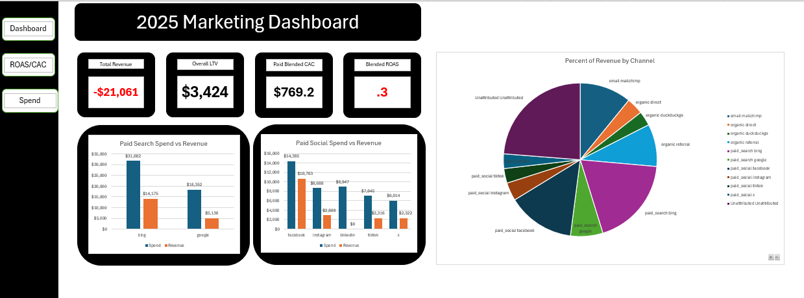

# Marketing Analytics Dashboard Project

This project demonstrates an end-to-end marketing analytics workflow using SQL data cleaning, structured data preparation, and final analysis through an Excel dashboard.



---

## Project Overview

The project covers the full lifecycle of preparing and analyzing marketing data:

1. **SQL Data Cleaning**  
   - Cleaned and standardized all staging tables (`stg_*`)  
   - Created raw snapshots for auditability  
   - Normalized inconsistent fields (emails, UTM parameters, devices, product names, campaign names)  
   - Removed formatting issues from currency fields and cast them to numeric types  
   - Standardized dates, strings, and category labels  
   - Checked and handled duplicate IDs  
   - Prepared all tables for Tableau/Excel analysis  

2. **Data Modeling & Preparation**  
   - Ensured consistent data types across tables  
   - Clean join keys for customer–order–product–session relationships  
   - Standardized marketing taxonomy (paid search, paid social, email, etc.)  
   - Validated schema with `sp_help` and column inspection  

3. **Excel Dashboard**  
   The final dashboard visualizes core marketing performance metrics, including:
   - Customer Acquisition Cost (CAC)  
   - Return on Ad Spend (ROAS)  
   - Monthly revenue trends  
   - Spend by channel  
   - Conversion rates  
   - Channel performance breakdowns  
   - Customer lookup and supporting data sheets  
```

## Skills Demonstrated

- SQL data cleaning & transformation  
- Standardizing marketing channel taxonomies  
- Preparing datasets for BI tools  
- Excel dashboard creation  
- Marketing analytics (CAC, ROAS, spend analysis, revenue trends)


